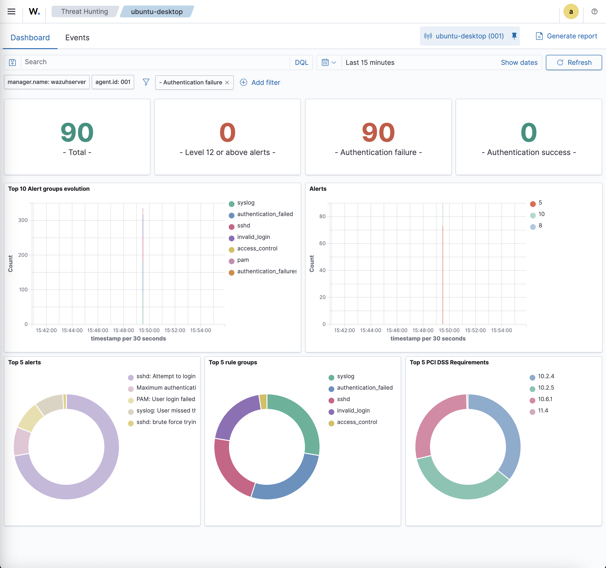
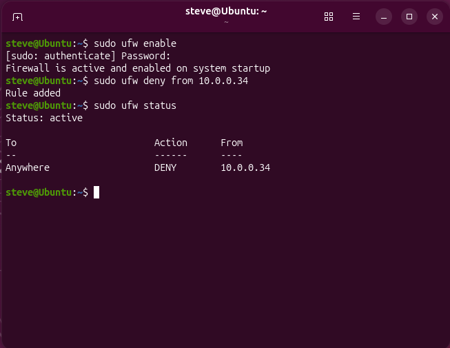
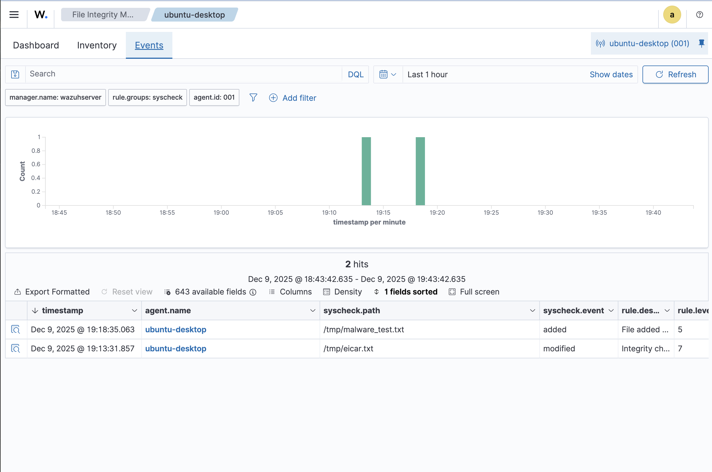
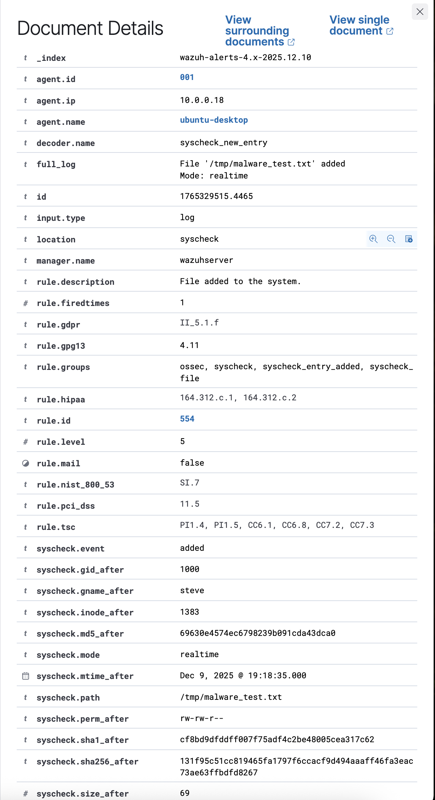
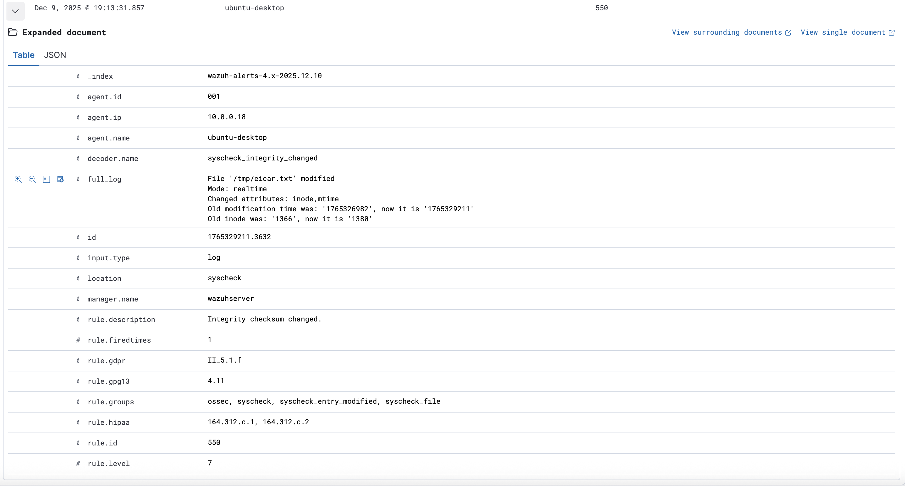

# 🛡️ SOC Analyst Homelab - Wazuh SIEM

Enterprise-grade Security Operations Center (SOC) homelab demonstrating real-time threat detection, incident response, and security monitoring using Wazuh SIEM.


---

## 📋 Table of Contents

- [Overview](#overview)
- [Lab Architecture](#lab-architecture)
- [Skills Demonstrated](#skills-demonstrated)
- [Attack Scenarios](#attack-scenarios)
- [Incident Reports](#incident-reports)
- [Response Playbooks](#response-playbooks)
- [Key Metrics](#key-metrics)
- [Tools & Technologies](#tools--technologies)
- [Screenshots](#screenshots)
- [Lessons Learned](#lessons-learned)

---

## Overview

This project simulates a real-world Security Operations Center environment where I detect, investigate, and respond to various cyber attacks. The goal is to demonstrate practical SOC analyst skills including:

- Real-time security event monitoring
- Alert triage and classification
- Incident investigation and documentation
- Threat containment and remediation
- Playbook development and execution

---

## Lab Architecture

```
┌─────────────────────────────────────────────────────────────────┐
│                      SOC ANALYST HOMELAB                        │
│                    Network: 10.0.0.0/24                         │
└─────────────────────────────────────────────────────────────────┘

    ┌─────────────────────────────────────────────────────────┐
    │              MacBook (SIEM Server)                      │
    │  ┌───────────────────────────────────────────────────┐  │
    │  │            Ubuntu Server 24.04 VM (UTM)           │  │
    │  │                   10.0.0.65                       │  │
    │  │  ┌─────────────┐ ┌─────────────┐ ┌─────────────┐  │  │
    │  │  │   Wazuh     │ │   Wazuh     │ │   Wazuh     │  │  │
    │  │  │   Manager   │ │   Indexer   │ │  Dashboard  │  │  │
    │  │  └─────────────┘ └─────────────┘ └─────────────┘  │  │
    │  └───────────────────────────────────────────────────┘  │
    └─────────────────────────────────────────────────────────┘
                                │
                    ┌───────────┴───────────┐
                    │   Network: 10.0.0.0/24│
                    └───────────┬───────────┘
                                │
    ┌───────────────────────────────────────────────────────────┐
    │                    iMac (Attack Lab)                      │
    │                                                           │
    │  ┌─────────────────────────────────────────────────────┐  │
    │  │                 UTM Virtual Machines                │  │
    │  │                                                     │  │
    │  │  ┌─────────┐    ┌─────────────┐    ┌─────────────┐  │  │
    │  │  │  KALI   │    │   UBUNTU    │    │   UBUNTU    │  │  │
    │  │  │  LINUX  │    │   DESKTOP   │    │   SERVER    │  │  │
    │  │  │         │    │             │    │             │  │  │
    │  │  │ Attacker│───▶│   Target    │    │   Target    │  │  │
    │  │  │   VM    │    │ + Wazuh     │    │ + Wazuh     │  │  │
    │  │  │         │    │   Agent     │    │   Agent     │  │  │
    │  │  │10.0.0.34│    │ 10.0.0.18   │    │ 10.0.0.186  │  │  │
    │  │  └─────────┘    └─────────────┘    └─────────────┘  │  │
    │  │                                                     │  │
    │  └─────────────────────────────────────────────────────┘  │
    │                                                           │
    └───────────────────────────────────────────────────────────┘
```

### Components

| Component | Role | IP Address |
|-----------|------|------------|
| Wazuh Server | SIEM - Manager, Indexer, Dashboard | 10.0.0.65 |
| Ubuntu Desktop | Primary Target + Wazuh Agent | 10.0.0.18 |
| Ubuntu Server | Secondary Target + Wazuh Agent | 10.0.0.186 |
| Kali Linux | Attack Platform (Red Team) | 10.0.0.34 |

---

## Attack Scenarios

| # | Scenario | MITRE ATT&CK | Status | Incident Report |
|---|----------|--------------|--------|-----------------|
| 1 | SSH Brute Force | T1110 - Brute Force | ✅ Complete | [INC-001](incidents/INC-001-SSH-Brute-Force.md) |
| 2 | Malware Detection (FIM) | T1565.001 - Stored Data Manipulation | ✅ Complete | [INC-002](incidents/INC-002-Malware-Detection.md) |
| 3 | Privilege Escalation | T1078 - Valid Acounts | ✅ Complete | INC-003 |
| 4 | Port Scanning | T1046 - Network Service Discovery | ⏳ Planned | INC-004 |
| 5 | SQL Injection | T1190 - Exploit Public-Facing App | ⏳ Planned | INC-005 |
| 6 | Suspicious Process | T1059 - Command and Scripting | ⏳ Planned | INC-006 |
| 7 | Lateral Movement | T1021 - Remote Services | ⏳ Planned | INC-007 |

---

## Incident Reports

Detailed documentation of each security incident including timeline, investigation steps, and escalation actions.

| Incident ID | Title | Severity | Classification | Link |
|-------------|-------|----------|----------------|------|
| INC-001 | SSH Brute Force Attack | 🔴 HIGH | True Positive | [View Report](incidents/INC-001-SSH-Brute-Force.md) |
| INC-002 | Suspicious File Detection (FIM) | 🟠 MEDIUM | True Positive | [View Report](incidents/INC-002-Malware-Detection.md) |

---

## Response Playbooks

Step-by-step Tier 1 procedures for triaging and escalating common security incidents.

| Playbook ID | Title | Threat Type | Link |
|-------------|-------|-------------|------|
| PB-001 | SSH Brute Force Detection & Triage | Credential Attack | [View Playbook](playbooks/PB-001-SSH-Brute-Force.md) |
| PB-002 | FIM / Suspicious File Response | Malware / File Integrity | [View Playbook](playbooks/PB-002-FIM-Malware-Detection.md) |

---

## Tools & Technologies

### Security Tools
- **Wazuh 4.x** - SIEM, IDS, FIM, Vulnerability Detection
- **Hydra** - Password cracking / brute force testing
- **Nmap** - Network scanning and reconnaissance
- **SQLmap** - SQL injection testing

### Infrastructure
- **UTM** - Virtualization platform (macOS)
- **Ubuntu Server 24.04** - SIEM host
- **Ubuntu Desktop 24.04** - Target endpoint
- **Kali Linux** - Attack platform

### Frameworks
- **MITRE ATT&CK** - Threat classification
- **NIST SP 800-61** - Incident response framework

---

## Screenshots

### Lab Overview


*Wazuh Dashboard showing monitored agents and security events*

---

### Scenario 1: SSH Brute Force Attack

#### Attack Detection


*Wazuh detecting 94 authentication failure events from brute force attack*

#### Alert Details


*Detailed view showing attacker IP, target system, and MITRE ATT&CK mapping (T1110)*

#### Attack Timeline


*Timeline showing burst of authentication attempts during attack window*

#### Containment


*UFW firewall rule blocking attacker IP address*

---

### Scenario 2: Malware Detection (FIM)

#### FIM Alert Overview


*Wazuh FIM detecting suspicious file added to /tmp directory*

#### File Added Alert (Rule 554)


*Alert details showing file path and MD5/SHA256 hashes*

#### File Modified Alert (Rule 550)


*FIM detecting file integrity change*


## Lessons Learned

### Technical Insights
1. **Real-time detection is critical** - Wazuh detected the brute force attack within seconds, enabling rapid response
2. **Log correlation reveals patterns** - Multiple rule IDs (5758, 5710, 2502) together confirmed automated attack vs. user error
3. **Defense in depth works** - SSH rate limiting + SIEM detection + firewall blocking created multiple defensive layers
4. **FIM provides early warning** - File Integrity Monitoring detected suspicious files immediately upon creation, enabling rapid triage

### Process Improvements
1. **Document as you go** - Capturing timestamps during the incident made report writing much easier
2. **Playbooks save time** - Having a documented procedure reduced response time significantly
3. **Collect hashes immediately** - Gathering MD5/SHA256 hashes are used to check threat intelligence quickly

---

## Future Enhancements

- [ ] Configure Wazuh Active Response for automated IP blocking
- [ ] Add Windows endpoint to lab environment
- [ ] Implement threat intelligence feeds
- [ ] Create custom Wazuh detection rules
- [ ] Set up automated reporting

---

## Acknowledgments

- [Wazuh Documentation](https://documentation.wazuh.com/)
- [MITRE ATT&CK Framework](https://attack.mitre.org/)
- [NIST Cybersecurity Framework](https://www.nist.gov/cyberframework)
- [NIST Cybersecurity Framework](https://www.nist.gov/cyberframework)
